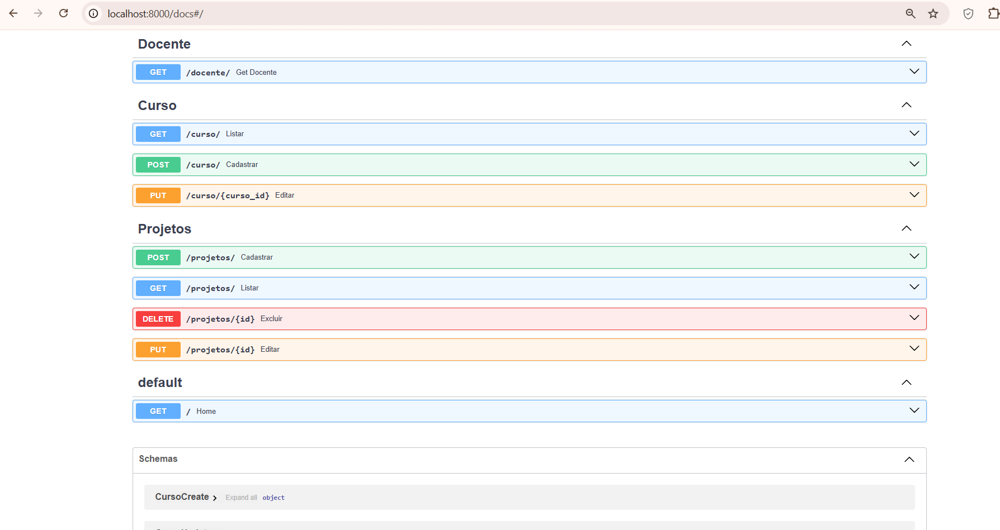
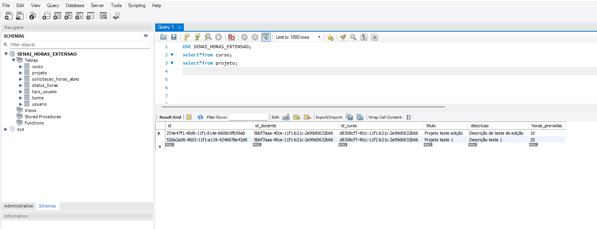

# Pull Request

## Descrição
Descreva de forma objetiva o que foi implementado neste PR.

Implementação completa do CRUD de projetos (Model, Schemas, Services e Routes).
Padronização do uso de UUID (CHAR 36) para identificação de projetos e cursos no banco de dados.
Configuração do ambiente Docker via docker-compose.yml e variáveis de ambiente no .env.

Qual o motivo da alteração?
Atender aos requisitos da Dupla 3, permitindo que docentes cadastrem projetos e garantindo a integridade dos dados através da "Regra de Ouro" (bloqueio de exclusão de projetos com solicitações vinculadas).

---

## Tipo de alteração
Selecione uma opção:

- [x] feat (nova funcionalidade)
- [ ] fix (correção de bug)
- [ ] refactor (melhoria interna sem alteração de comportamento)
- [ ] chore (tarefas técnicas ou manutenção)
- [ ] docs (documentação)

---

## Issue relacionada
Informe a issue vinculada, se houver:

Closes #

---

## Como testar
Descreva o passo a passo para validação:

1. Acesse o Swagger

2. Teste de Criação: Use o POST /projetos com um id_curso e id_docente existentes.

O curso precisa existir no banco. Para o docente, usamos um código fixo em routes/projects.py, visto que o sistema de autenticação ainda não foi finalizado pela Dupla 1.

3. Teste de Edição: Use o PUT /projetos/{id} para atualizar um projeto já cadastrado.

Você deve passar o UUID do projeto na URL e, no corpo da requisição, enviar os dados atualizados (título, descrição, horas e o id_curso).

Importante: Assim como no cadastro, o id_curso enviado deve ser um UUID válido que já exista na tabela de cursos do seu banco de dados.

4. Teste de Exclusão: Tente deletar um projeto usando o DELETE /projetos/{id}.

Valide se a API bloqueia a exclusão caso o projeto possua vínculo na tabela solicitacao_horas_aluno (Regra de Ouro).

---

## Evidências (opcional)

---

## Impacto
Selecione os impactos deste PR:

- [ ] Sem impacto relevante
- [x] Backend
- [ ] Banco de dados

---

## Riscos
Classifique o risco da alteração:

- [x] Baixo
- [ ] Médio
- [ ] Alto

Detalhamento (se necessário):

---

## Checklist
Antes de solicitar revisão, confirme:

- [x] Código testado localmente
- [x] Segue os padrões do projeto
- [x] Não impacta funcionalidades existentes
- [ ] Testes adicionados ou atualizados (quando aplicável)
- [ ] Documentação atualizada (quando necessário)

---

## Pontos de atenção para revisão
A função excluir_projeto realiza uma consulta prévia na tabela solicitacao_horas_aluno para impedir a deleção de projetos que já possuam vínculos, garantindo a integridade referencial exigida no cronograma.

Rotas e funções foram nomeadas em português para manter a consistência com os protótipos do Figma e facilitar a leitura do código por toda a equipe.

POST /projetos utiliza temporariamente um UUID fixo (id_professor_fake) no arquivo de rotas. Isso é necessário para contornar a ausência do sistema de autenticação (Dupla 1) e deve ser substituído pelo ID do usuário logado.

Para testes no Swagger, é obrigatório utilizar um id_curso que já exista no banco de dados, caso contrário o MySQL retornará erro de Foreign Key.

---

## Deploy
Existe alguma ação necessária para deploy?

- [ ] Nenhuma
- [ ] Migration de banco de dados
- [x] Variáveis de ambiente
- [ ] Configuração adicional

Detalhes: Criado o arquivo .env

-